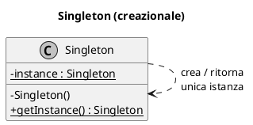
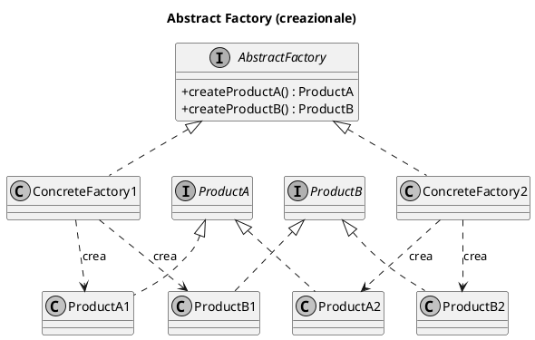
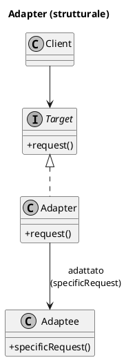
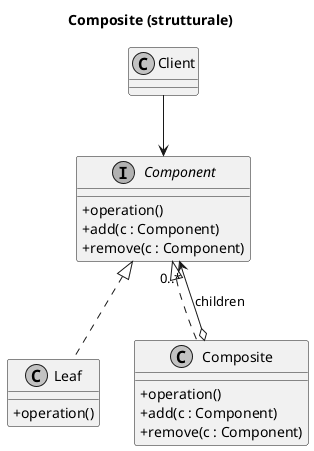
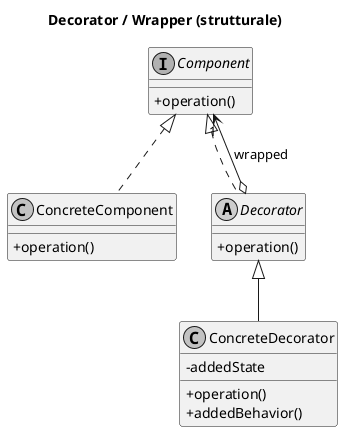
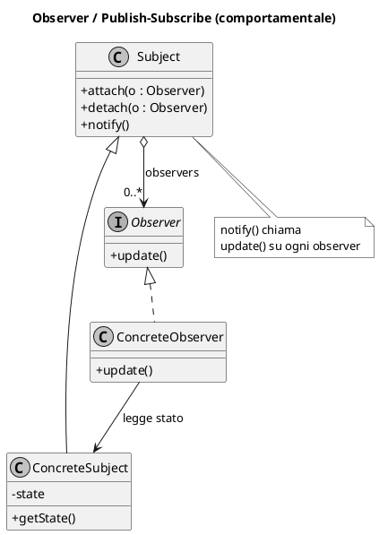
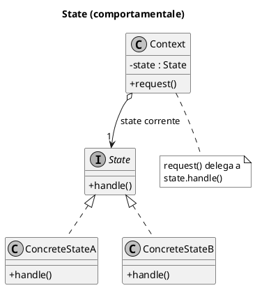
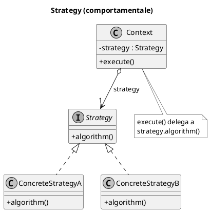
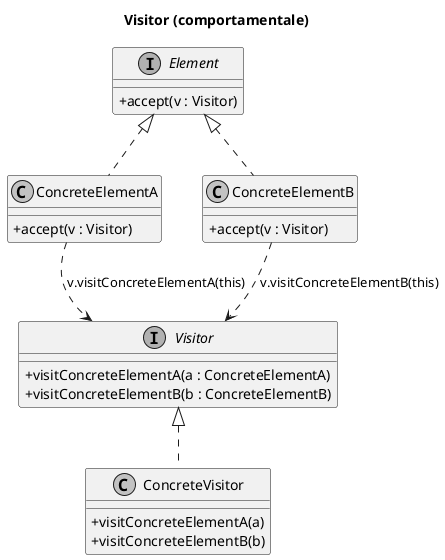

# RIPASSO SAS — Sviluppo delle Applicazioni Software

> Scheda di ripasso completa per l'esonero. Costruita su 3 prove reali
> (15/06/2021, 16/12/2024 aperte + chiuse) e sui lucidi *Lab SAS 11 GRASP*,
> *12 Esempio GRASP*, *13 GoF*.
>
> **Come si studia questo file**
> 1. Leggi §1–§7 (teoria) una volta, lentamente.
> 2. Impara a memoria §8 (trappole V/F) e §9 (match problema→pattern): è ciò che frutta più punti nelle chiuse.
> 3. Esercitati a scrivere a memoria le schede GoF §6 (Problema/Soluzione + UML) — è la domanda aperta n.2.
> 4. Allenati con §11 (mock aperte) a tempo, poi confronta con le risposte modello.

---

## 0. Struttura dell'esonero

| Parte | Tipo | Punti | Cosa chiede |
|---|---|---|---|
| Aperte | 2 domande | ~5,5 cad. | (1) confronto su processi sw + 4 attività; (2) descrivi un pattern GoF (Nome/Problema/Soluzione) + **disegna UML** |
| Chiuse | 4–6 domande | ~5 cad. | Vero/Falso a gruppi + match problema→pattern + lettura molteplicità UML |

Argomenti mai assenti: **GRASP vs GoF**, **Strategy vs State**, **modello di dominio**, **requisiti/casi d'uso**, **processi (UP)**, **testing**, **riuso (delega/composizione/ereditarietà)**.

---

## 1. Processi di sviluppo software

### Le 4 attività fondamentali (Sommerville)
1. **Specifica** — definire cosa il sistema deve fare (requisiti).
2. **Sviluppo (progettazione + implementazione)** — produrre il software.
3. **Convalida (validazione)** — verificare che faccia ciò che serve (test).
4. **Evoluzione** — modificarlo per nuovi bisogni.

### Cascata (waterfall)
Le 4 attività sono **fasi separate e sequenziali**: una inizia quando la precedente finisce, con documento di consegna. Rigido, ritorni indietro costosi. Adatto a requisiti stabili e ben noti.

### Incrementale
Le 4 attività si **intrecciano** e si ripetono su incrementi successivi: specifica-sviluppo-convalida avvengono in parallelo su versioni che crescono. Feedback rapido, gestisce requisiti che cambiano. Meno documentazione, struttura può degradare.

> **Differenza sostanziale (frase da esame, ~5 righe):**
> Nel modello a cascata specifica, sviluppo, convalida ed evoluzione sono fasi
> distinte e sequenziali, completate una alla volta; nel modello incrementale
> le stesse attività si intrecciano e si ripetono su incrementi successivi del
> sistema, consentendo feedback continuo e gestione dei requisiti che cambiano.

### Unified Process (UP)
- **Iterativo e incrementale**, guidato dai casi d'uso e centrato sull'architettura.
- **4 fasi** (temporali): **Ideazione → Elaborazione → Costruzione → Transizione**.
- **Discipline** (modellazione business, requisiti, progettazione, implementazione, test, rilascio): **si intrecciano**, non sono separate temporalmente — in ogni iterazione se ne svolgono più di una con intensità variabile.
- Ogni iterazione produce un incremento eseguibile; usa refactoring per i cambiamenti.

> Trappole: «le fasi UP non si intrecciano mai» = **FALSO**. «UP usa il refactoring» = **VERO**.

---

## 2. Requisiti e Casi d'Uso

- **Requisito funzionale**: cosa il sistema deve fare (un servizio/funzione).
- **Requisito non funzionale**: vincoli e qualità (prestazioni, sicurezza, usabilità). **NON** sono descritti completamente dai casi d'uso.
- **Caso d'uso (UC)**: una **maniera di usare il sistema da parte di un attore per raggiungere un obiettivo**. NON è «l'insieme di tutte le funzionalità».
- **Specifiche Supplementari**: raccolgono i requisiti **non** catturati dai casi d'uso (tipicamente i non funzionali, vincoli, regole).
- **Disciplina dei requisiti in UP**: produrre la lista dei requisiti, capire il contesto del sistema, catturare requisiti funzionali e non funzionali.

> Trappole: «UC = insieme di tutte le funzionalità» = **FALSO**. «requisiti non funzionali descritti completamente dai UC» = **FALSO**.

---

## 3. Modello di Dominio

- È un **dizionario visuale delle classi concettuali** del dominio (oggetti reali del mondo, non software).
- Mostra: **classi concettuali, associazioni, attributi** — **concettuali**, non oggetti/attributi *software*.
- È **visuale** (UML), non testuale.
- Si costruisce dall'**analisi linguistica dei casi d'uso in formato dettagliato** (i sostantivi → candidati concetti).
- Riporta i concetti significativi relativi ai casi d'uso.

> Trappole: «include oggetti e attributi *software*» = **FALSO** (è concettuale). «è una rappresentazione *testuale*» = **FALSO** (è visuale).

---

## 4. Responsabilità e Riuso del codice

### Responsibility-Driven Design (RDD)
Vedere il software come **comunità di oggetti con responsabilità che collaborano**. Due tipi di responsabilità:
- **Di conoscenza** (knowing): conoscere i propri dati/attributi, gli oggetti correlati, ciò che può derivare. → *un attributo è una responsabilità di conoscenza.*
- **Di esecuzione** (doing): fare qualcosa, creare oggetti, coordinare, controllare.

Passi RDD: identificare le responsabilità → assegnarle → indagare come soddisfarle. I **pattern GRASP** sono lo strumento di **assegnazione** (design), **non** di scoperta dei requisiti.

### Delega vs Ereditarietà (riuso)
| | Meccanismo | Riuso | Incapsulamento |
|---|---|---|---|
| **Composizione/Delega** | un oggetto ne contiene un altro e gli delega | **black-box** (riuso senza vedere l'interno) | **rispetta** l'incapsulamento |
| **Ereditarietà** | sottoclasse estende superclasse | **white-box** (la sottoclasse vede i dettagli del padre) | **viola** l'incapsulamento |

Principio: «**favorire la composizione sull'ereditarietà**». La delega è preferibile per il riuso.

> Trappole: «GoF usano l'ereditarietà per il *polimorfismo*» = **VERO**. «GoF usano l'ereditarietà per il *riuso* via Composite» = **FALSO** (Composite usa composizione). «Composizione = riuso black-box» = **VERO**. «L'ereditarietà rispetta l'incapsulamento» = **FALSO**.

---

## 5. GRASP — i 9 pattern (Problema → Soluzione)

> GRASP = *General Responsibility Assignment Software Patterns*. Servono al **design** (assegnare responsabilità), non a scoprire requisiti. **Abstract Factory NON è GRASP** (è GoF).

1. **Creator** — *Chi crea un'istanza di A?* → La classe B crea A se B: aggrega A, contiene A, registra A, usa intensamente A, o ha i dati per inizializzarlo (più condizioni vere, meglio è). Favorisce Low Coupling.
2. **Information Expert** — *Principio base per assegnare una responsabilità?* → Alla classe che possiede le **informazioni necessarie** per soddisfarla (l'esperto).
3. **Controller** — *Chi è il primo oggetto, oltre la UI, che riceve e coordina un'operazione di sistema?* → Un oggetto che rappresenta il sistema/radice/dispositivo (facade controller) **oppure** uno scenario di caso d'uso (use-case controller). È **delega**: riceve e delega al dominio.
4. **Low Coupling** — *Come ridurre l'impatto dei cambiamenti e favorire il riuso?* → Assegna responsabilità mantenendo basso l'accoppiamento (specie verso elementi instabili).
5. **High Cohesion** — *Come tenere gli oggetti focalizzati e gestibili?* → Assegna responsabilità mantenendo alta la coesione (un oggetto = responsabilità correlate).
6. **Polymorphism** — *Come gestire alternative basate sul tipo?* → Usa operazioni polimorfe assegnate ai tipi che variano, invece di `if/switch` sul tipo.
7. **Pure Fabrication** — *Dove mettere una responsabilità per non rovinare la coesione del dominio?* → In una classe artificiale **non** del dominio (es. classi di persistenza), per sostenere High Cohesion e Low Coupling.
8. **Indirection** — *Come disaccoppiare due oggetti?* → Introduci un oggetto **intermedio** che fa da mediatore (es. il receiver/observer tra dominio e storage).
9. **Protected Variations** — *Come proteggere dai cambiamenti su punti di variazione previsti?* → Avvolgi i punti instabili dietro un'**interfaccia stabile** (polimorfismo/incapsulamento).

---

## 6. GoF — schede con UML (Problema / Soluzione / Struttura)

> Classificazione GoF per scopo: **Creazionali** (istanziazione), **Strutturali** (struttura di classi/oggetti), **Comportamentali** (interazione). Da saper *descrivere e disegnare*.

### 6.1 Singleton (creazionale)
- **Problema:** è richiesta una sola istanza, con punto di accesso globale.
- **Soluzione:** costruttore privato + metodo statico che restituisce l'unica istanza (lazy: creata al primo accesso).

### 6.2 Abstract Factory (creazionale)
- **Problema:** creare **famiglie** di oggetti correlati che implementano un'interfaccia comune, senza legare il client alle classi concrete.
- **Soluzione:** un'interfaccia *factory astratta* con metodi di creazione; una *factory concreta* per ogni famiglia.

### 6.3 Adapter (strutturale)
- **Problema:** **gestire interfacce incompatibili**, o fornire un'interfaccia stabile a comportamenti simili con interfacce diverse.
- **Soluzione:** converti l'interfaccia originale di un componente in quella attesa, tramite un **oggetto adattatore intermedio**.

### 6.4 Composite (strutturale)
- **Problema:** trattare una struttura ad albero di oggetti **(composti e atomici)** in modo uniforme.
- **Soluzione:** composti e foglie implementano la **stessa interfaccia** Component; il Composite contiene figli Component.

### 6.5 Decorator (strutturale, *Wrapper*)
- **Problema:** aggiungere responsabilità a un oggetto **dinamicamente**, come alternativa flessibile alla sottoclasse, evitando gerarchie complesse.
- **Soluzione:** **ingloba** l'oggetto in un wrapper che implementa la stessa interfaccia e aggiunge comportamento prima/dopo aver delegato.

> **Composite vs Decorator**: stessa idea di interfaccia condivisa, ma Composite = *struttura ad albero* (molti figli), Decorator = *catena di wrapper* (un solo wrappato, aggiunge funzioni).

### 6.6 Observer (comportamentale, *Publish-Subscribe*)
- **Problema:** più oggetti **subscriber** vogliono essere informati dei cambi di stato/eventi di un **publisher**, con accoppiamento basso.
- **Soluzione:** definisci un'interfaccia Observer/listener; il Subject registra dinamicamente gli observer e li **notifica** al cambiamento.

### 6.7 State (comportamentale)
- **Problema:** il comportamento di un oggetto **dipende dal suo stato**; i metodi cambiano con lo stato. Alternativa alla logica condizionale.
- **Soluzione:** una **classe per ogni stato** con interfaccia comune; il Context delega all'oggetto-stato corrente e lo aggiorna.

### 6.8 Strategy (comportamentale)
- **Problema:** gestire una **famiglia di algoritmi/politiche** variabili ma correlati, intercambiabili e modificabili.
- **Soluzione:** ogni algoritmo in una **classe separata** con interfaccia comune; il Context referenzia una Strategy e le delega.

### 6.9 Visitor (comportamentale)
- **Problema:** separare un'operazione dalla struttura dati cui è applicata; aggiungere nuove operazioni senza modificare le classi della struttura.
- **Soluzione:** doppio dispatch — gli elementi espongono `accept(visitor)`, il visitor ha un `visit()` per ogni tipo di elemento.

---

## 7. State vs Strategy (la trappola più frequente)

| | **Strategy** | **State** |
|---|---|---|
| Incapsula | un **algoritmo**/politica | un **comportamento legato allo stato** |
| Scopo | scegliere/scambiare *come* fare un compito | cambiare comportamento al variare dello *stato interno* |
| Chi cambia la classe usata | il **client** (sceglie la strategia) | l'**oggetto stesso** (transizioni di stato) |
| Struttura UML | quasi **identica** (Context → interfaccia → implementazioni concrete) | quasi identica |

> Frasi V/F tipiche:
> - «Strategy incapsula un algoritmo» = **VERO**
> - «State incapsula un algoritmo» = **FALSO** (incapsula lo stato/comportamento)
> - «State consente una famiglia di algoritmi intercambiabili» = **FALSO** (quello è Strategy)
> - «State e Strategy sono sintatticamente simili ma differiscono nell'applicazione» = **VERO**

---

## 8. Testing

- **TDD (Test-Driven Development):** scrivi prima il test, poi il codice che lo fa passare (red → green → refactor). È pratica di **eXtreme Programming (XP)**, **non** della cascata.
- **Test unitario:** verifica una **singola unità** (classe/metodo) in isolamento. **NON** verifica la comunicazione tra parti.
- **Test di integrazione:** verifica il **collegamento tra più parti** del sistema.
- **Fasi di un test (AAA):** preparazione (*Arrange*) → esecuzione (*Act*) → verifica (*Assert*). (Non c'è «rilascio» tra le fasi di un test.)
- **Refactoring:** migliorare la struttura interna senza cambiarne il comportamento; pratica XP, supportata dai test.

> Trappole: «test unitario verifica la comunicazione tra parti» = **FALSO**. «TDD è pratica della cascata» = **FALSO** (è XP). «le fasi di un test unitario includono il rilascio» = **FALSO**.

---

## 9. Match problema → pattern (domanda chiusa ricorrente)

| Frase-problema (trigger) | Pattern |
|---|---|
| «insieme di **algoritmi/politiche variabili ma correlati**, modificabili» | **Strategy** |
| «assegnare **responsabilità addizionali dinamicamente**, alternativa alla sottoclasse, evitare gerarchia complessa» | **Decorator** |
| «gestire **interfacce incompatibili** / interfaccia stabile a comportamenti simili» | **Adapter** |
| «**publisher** registra dinamicamente **subscriber** e li avvisa su evento» | **Observer** |
| «comportamento **dipende dallo stato**, alternativa alla logica condizionale» | **State** |
| «trattare **struttura ad albero** (composti+atomici) in modo uniforme» | **Composite** |
| «una sola istanza con accesso globale» | **Singleton** |
| «creare **famiglie** di oggetti correlati» | **Abstract Factory** |
| «aggiungere **operazioni** a una struttura stabile senza modificarne le classi» | **Visitor** |

---

## 10. Lettura delle molteplicità UML (domanda chiusa tipo "R può essere…")

Data un'associazione tra A e B con molteplicità, una relazione R (insieme di coppie) è valida **solo se rispetta i vincoli su entrambi i lati**.

Promemoria simboli:
- `1` → esattamente uno · `0..1` → zero o uno · `*` o `0..*` → zero o più · `1..*` → uno o più.

Metodo per le V/F:
1. Per ogni elemento di A, conta quanti B lo accompagnano → deve stare nella molteplicità sul lato B.
2. Per ogni elemento di B, conta quanti A → deve stare nella molteplicità sul lato A.
3. **Coppie duplicate** (es. `(a2,b2),(a2,b2)`) → in una relazione insiemistica non contano due volte, ma se la domanda elenca un duplicato come se fosse multiplo → spesso **FALSO**.
4. Se un elemento obbligatorio (`1..*`) resta **senza** coppia → **FALSO**.

> Esempio reale (15/06/21, A={a1..a4}, B={b1,b2}): la R valida era quella in cui **ogni a** compariva esattamente una volta e copriva tutti gli a1..a4 → `{(a1,b1),(a2,b2),(a3,b1),(a4,b2)}` = **VERA**; quelle che lasciavano a fuori un elemento o duplicavano una coppia = **FALSE**.

---

## 11. Mock — Domande Aperte (con risposte modello)

### Mock A1 — Processi
**Spiega in ≤5 righe la differenza tra cascata e incrementale, citando le 4 attività.**
> *Modello.* Le quattro attività di un processo software sono specifica, sviluppo,
> convalida ed evoluzione. Nel modello a cascata sono fasi separate e sequenziali:
> ciascuna termina prima dell'inizio della successiva, rendendo costosi i ritorni
> indietro. Nel modello incrementale le stesse attività si intrecciano e si
> ripetono su incrementi successivi del sistema, permettendo feedback continuo e
> una migliore gestione dei requisiti che cambiano.

### Mock A2 — Pattern GoF Observer (Nome/Problema/Soluzione + UML)
> *Nome:* Observer (Publish-Subscribe), comportamentale.
> *Problema:* più oggetti subscriber sono interessati ai cambiamenti di stato o agli
> eventi di un oggetto publisher e vogliono esserne notificati, mantenendo basso
> l'accoppiamento.
> *Soluzione:* si definisce un'interfaccia Observer con `update()`; il Subject
> mantiene una lista di observer, espone `attach/detach` e, al cambiamento, esegue
> `notify()` chiamando `update()` su ciascun observer registrato.
> *UML:* (vedi §6.6) Subject con attach/detach/notify in aggregazione con Observer;
> ConcreteSubject e ConcreteObserver come specializzazioni.

### Mock A3 — Pattern GoF Strategy
> *Nome:* Strategy, comportamentale.
> *Problema:* gestire una famiglia di algoritmi/politiche correlati ma variabili,
> intercambiabili e modificabili indipendentemente dal client.
> *Soluzione:* ogni algoritmo è incapsulato in una classe separata che implementa
> un'interfaccia comune; il Context referenzia una Strategy e le delega l'esecuzione,
> potendola sostituire a runtime.
> *UML:* (vedi §6.8).

### Mock A4 — Pattern GoF Singleton
> *Nome:* Singleton, creazionale.
> *Problema:* è richiesta una sola istanza di una classe, con un punto di accesso
> globale e unico.
> *Soluzione:* costruttore privato e metodo statico `getInstance()` che crea
> l'istanza al primo accesso (lazy) e restituisce sempre la stessa.
> *UML:* (vedi §6.1).

### Mock A5 — GRASP Controller
> *Nome:* Controller (GRASP).
> *Problema:* qual è il primo oggetto, oltre lo strato UI, che riceve e coordina
> un'operazione di sistema?
> *Soluzione:* assegnare la responsabilità a un oggetto che rappresenta l'intero
> sistema/un oggetto radice (facade controller) oppure uno scenario di caso d'uso
> (use-case controller). Il controller non esegue il lavoro: riceve la richiesta e
> la **delega** agli oggetti del dominio (esperti), mantenendo alta la coesione.

---

## 12. Mini-glossario lampo

- **GRASP** = pattern di assegnazione responsabilità (design). 9 pattern.
- **GoF** = 23 pattern (creazionali/strutturali/comportamentali). Da descrivere + UML.
- **Coupling basso / Cohesion alta** = obiettivi di buona progettazione OO.
- **Black-box reuse** = composizione/delega. **White-box reuse** = ereditarietà.
- **Modello di dominio** = dizionario *visuale* di classi *concettuali*.
- **Caso d'uso** = un modo di usare il sistema per un obiettivo dell'attore.
- **TDD/refactoring** = pratiche XP. **Unit test** ≠ test di integrazione.
- **Abstract Factory ≠ GRASP** (è GoF). **State ≠ Strategy** (stato vs algoritmo).
